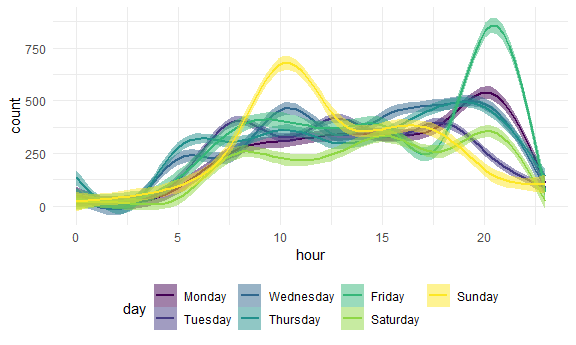
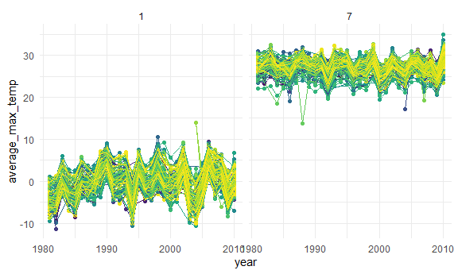
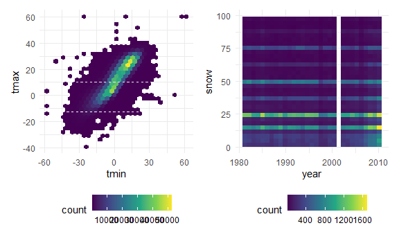

Homework 3
================
Eric Sun

Initial setup

``` r
library(tidyverse)
```

    ## -- Attaching packages ------------------------------------------------------------------------------------------------------------------------------------------------------------------- tidyverse 1.3.0 --

    ## v ggplot2 3.3.2     v purrr   0.3.4
    ## v tibble  3.0.3     v dplyr   1.0.2
    ## v tidyr   1.1.2     v stringr 1.4.0
    ## v readr   1.3.1     v forcats 0.5.0

    ## -- Conflicts ---------------------------------------------------------------------------------------------------------------------------------------------------------------------- tidyverse_conflicts() --
    ## x dplyr::filter() masks stats::filter()
    ## x dplyr::lag()    masks stats::lag()

``` r
library(p8105.datasets)
library(viridis)
```

    ## Loading required package: viridisLite

``` r
library(patchwork)

knitr::opts_chunk$set(
  fig.width = 6,
  fig.asp = .6,
  out.width = "90%"
)

theme_set(theme_minimal() + theme(legend.position = "bottom"))

options(
  ggplot2.continuous.colour = "viridis",
  ggplot2.continuous.fill = "viridis"
)

scale_colour_discrete = scale_colour_viridis_d
scale_fill_discrete = scale_fill_viridis_d
```

# Problem 1

``` r
data("instacart")
```

This dataset contains 1384617 rows and … columns.

Observations are the level of items in orders by user. There are user /
order variables – user ID, order ID, order day, and order hour. There
are also item variables – name, aisle, department, and some numeric
codes.

How many aisles, and which are most items from?

``` r
instacart %>% 
    count(aisle) %>% 
    arrange(desc(n))
```

    ## # A tibble: 134 x 2
    ##    aisle                              n
    ##    <chr>                          <int>
    ##  1 fresh vegetables              150609
    ##  2 fresh fruits                  150473
    ##  3 packaged vegetables fruits     78493
    ##  4 yogurt                         55240
    ##  5 packaged cheese                41699
    ##  6 water seltzer sparkling water  36617
    ##  7 milk                           32644
    ##  8 chips pretzels                 31269
    ##  9 soy lactosefree                26240
    ## 10 bread                          23635
    ## # ... with 124 more rows

Let’s make a plot

``` r
instacart %>% 
    count(aisle) %>% 
    filter(n > 10000) %>% 
    mutate(
        aisle = factor(aisle),
        aisle = fct_reorder(aisle, n)
    ) %>% 
    ggplot(aes(x = aisle, y = n)) + 
    geom_point() + 
    theme(axis.text.x = element_text(angle = 90, vjust = 0.5, hjust = 1))
```


Let’s make a table

``` r
instacart %>% 
    filter(aisle %in% c("baking ingredients", "dog food care", "packaged vegetables fruits")) %>% 
    group_by(aisle) %>% 
    count(product_name) %>% 
    mutate(rank = min_rank(desc(n))) %>% 
    filter(rank < 4) %>% 
    arrange(aisle, rank) %>% 
    knitr::kable()
```

| aisle                      | product\_name                                 |    n | rank |
| :------------------------- | :-------------------------------------------- | ---: | ---: |
| baking ingredients         | Light Brown Sugar                             |  499 |    1 |
| baking ingredients         | Pure Baking Soda                              |  387 |    2 |
| baking ingredients         | Cane Sugar                                    |  336 |    3 |
| dog food care              | Snack Sticks Chicken & Rice Recipe Dog Treats |   30 |    1 |
| dog food care              | Organix Chicken & Brown Rice Recipe           |   28 |    2 |
| dog food care              | Small Dog Biscuits                            |   26 |    3 |
| packaged vegetables fruits | Organic Baby Spinach                          | 9784 |    1 |
| packaged vegetables fruits | Organic Raspberries                           | 5546 |    2 |
| packaged vegetables fruits | Organic Blueberries                           | 4966 |    3 |

Apples vs ice cream

``` r
instacart %>% 
    filter(product_name %in% c("Pink Lady Apples", "Coffee Ice Cream")) %>% 
    group_by(product_name, order_dow) %>% 
    summarize(mean_hour = mean(order_hour_of_day)) %>% 
    pivot_wider(
        names_from = order_dow,
        values_from = mean_hour
    )
```

    ## `summarise()` regrouping output by 'product_name' (override with `.groups` argument)

    ## # A tibble: 2 x 8
    ## # Groups:   product_name [2]
    ##   product_name       `0`   `1`   `2`   `3`   `4`   `5`   `6`
    ##   <chr>            <dbl> <dbl> <dbl> <dbl> <dbl> <dbl> <dbl>
    ## 1 Coffee Ice Cream  13.8  14.3  15.4  15.3  15.2  12.3  13.8
    ## 2 Pink Lady Apples  13.4  11.4  11.7  14.2  11.6  12.8  11.9

# Problem 2

Load, tidy, wrangle data; include a weekday vs weekend variable; and
encode data with reasonable variable classes

``` r
accel_df = read_csv("./data/accel_data.csv") %>%
  pivot_longer(activity.1:activity.1440, names_to = "minute", names_prefix="activity.", values_to = "count") %>%
  mutate(day=factor(day,c("Monday", "Tuesday", "Wednesday", "Thursday","Friday","Saturday","Sunday"))) %>%
  mutate(weekend=case_when(
    day %in% c("Saturday","Sunday") ~ "TRUE",
    day %in% c("Monday", "Tuesday", "Wednesday", "Thursday","Friday") ~ "FALSE")) %>%
  mutate(weekend=as.logical(weekend)) %>%
  mutate(minute=as.numeric(minute))
```

    ## Parsed with column specification:
    ## cols(
    ##   .default = col_double(),
    ##   day = col_character()
    ## )

    ## See spec(...) for full column specifications.

``` r
accel_df
```

    ## # A tibble: 50,400 x 6
    ##     week day_id day    minute count weekend
    ##    <dbl>  <dbl> <fct>   <dbl> <dbl> <lgl>  
    ##  1     1      1 Friday      1  88.4 FALSE  
    ##  2     1      1 Friday      2  82.2 FALSE  
    ##  3     1      1 Friday      3  64.4 FALSE  
    ##  4     1      1 Friday      4  70.0 FALSE  
    ##  5     1      1 Friday      5  75.0 FALSE  
    ##  6     1      1 Friday      6  66.3 FALSE  
    ##  7     1      1 Friday      7  53.8 FALSE  
    ##  8     1      1 Friday      8  47.8 FALSE  
    ##  9     1      1 Friday      9  55.5 FALSE  
    ## 10     1      1 Friday     10  43.0 FALSE  
    ## # ... with 50,390 more rows

The accel\_df database contains 50400 rows and 6 columns. The variables
describe the timing of the observations and the amount of activity for
each observation.

Aggregate across minutes to create a total activity variable for each
day, and create a table showing these totals

``` r
accel_df %>%
  group_by(day) %>%
  summarize(sum=sum(count))
```

    ## `summarise()` ungrouping output (override with `.groups` argument)

    ## # A tibble: 7 x 2
    ##   day            sum
    ##   <fct>        <dbl>
    ## 1 Monday    1858699.
    ## 2 Tuesday   1799238.
    ## 3 Wednesday 2129772.
    ## 4 Thursday  2091151.
    ## 5 Friday    2291711.
    ## 6 Saturday  1369237 
    ## 7 Sunday    1919213

After creating the table of activity by day, you can see that this
patient is most active from Wednesday-Friday and least active on
Saturday.

Plot of activity for each day

``` r
accel_df %>%
  mutate(hour=case_when(
    minute< 60 ~ 0,
    minute< 120 ~ 1,
    minute< 180 ~ 2,
    minute< 240 ~ 3,
    minute< 300 ~ 4,
    minute< 360 ~ 5,
    minute< 420 ~ 6,
    minute< 480 ~ 7,
    minute< 540 ~ 8,
    minute< 600 ~ 9,
    minute< 660 ~ 10,
    minute< 720 ~ 11,
    minute< 780 ~ 12,
    minute< 840 ~ 13,
    minute< 900 ~ 14,
    minute< 960 ~ 15,
    minute< 1020 ~ 16,
    minute< 1080 ~ 17,
    minute< 1140 ~ 18,
    minute< 1200 ~ 19,
    minute< 1260 ~ 20,
    minute< 1320 ~ 21,
    minute< 1380 ~ 22,
    minute<=1440 ~ 23
  )) %>%
  ggplot(aes(x=hour, y=count, color=day, fill=day)) +
  geom_smooth(alpha=.5)
```

    ## `geom_smooth()` using method = 'gam' and formula 'y ~ s(x, bs = "cs")'



Based on the graph, the patient is least active at night and starts to
increase activity around hour 3. He hits a peak around hour 10 and a
second peak around hour 20, after which his activity decreases sharply.

# Problem 3

Load dataset

``` r
data("ny_noaa")
```

Describe dataset

``` r
ny_noaa %>%
  select(prcp:tmin) %>%
  summarise_all(funs(sum(is.na(.))))
```

    ## Warning: `funs()` is deprecated as of dplyr 0.8.0.
    ## Please use a list of either functions or lambdas: 
    ## 
    ##   # Simple named list: 
    ##   list(mean = mean, median = median)
    ## 
    ##   # Auto named with `tibble::lst()`: 
    ##   tibble::lst(mean, median)
    ## 
    ##   # Using lambdas
    ##   list(~ mean(., trim = .2), ~ median(., na.rm = TRUE))
    ## This warning is displayed once every 8 hours.
    ## Call `lifecycle::last_warnings()` to see where this warning was generated.

    ## # A tibble: 1 x 5
    ##     prcp   snow   snwd    tmax    tmin
    ##    <int>  <int>  <int>   <int>   <int>
    ## 1 145838 381221 591786 1134358 1134420

The ny\_noaa database contains 2595176 rows and 7 columns. For each date
and weather station, the dataset contains the amount of precipitation
(prcp), snowfall (snow), snow depth (snwd), maximum temperature (tmax)
and minimum temperature (tmin). There are a significant amount of
missing values with 0.0561958 of prcp, 0.146896 of snow, 0.2280331 of
snwd, 0.4371025 of tmax and 0.4371264 of tmin missing.

Clean data, separate date, change units, and find most common observed
value of snowfall

``` r
ny_noaa = ny_noaa %>%
  mutate(prcp=prcp/10) %>%
  mutate(tmax=as.numeric(tmax)/10) %>%
  mutate(tmin=as.numeric(tmin)/10) %>%
  separate(date,into=c("year","month","day"),sep="-",remove=TRUE,convert=TRUE,extra="warn",fill="warn")

ny_noaa %>%
  group_by(snow)%>%
  summarize(n_obs=n()) %>%
  mutate(snow_rank=min_rank(desc(n_obs))) %>%
  filter(snow_rank<=5)
```

    ## `summarise()` ungrouping output (override with `.groups` argument)

    ## # A tibble: 5 x 3
    ##    snow   n_obs snow_rank
    ##   <int>   <int>     <int>
    ## 1     0 2008508         1
    ## 2    13   23095         4
    ## 3    25   31022         3
    ## 4    51   18274         5
    ## 5    NA  381221         2

The most commonly observed values of snowfall are 0 by far, followed by
25, 13, and 51. 0 is most common because it is more likely than not not
snowing on any given day. The other values are close to .5, 1, and 2
inches which is probably the unit of measure that is being used in the
US.

Two-panel plot showing the average max temperature in January and in
July in each station across years

``` r
ny_noaa%>%
  select(id,year,month,tmax) %>%
  filter(month==c("1","7")) %>%
  drop_na(tmax) %>%
  group_by(id,year,month) %>%
  summarize(average_max_temp=mean(tmax)) %>%
  ggplot(aes(x=year,y=average_max_temp, group=id, color=id))+
  geom_point() +
  geom_path()+
  facet_grid(. ~ month) +
  theme(legend.position="none")
```

    ## `summarise()` regrouping output by 'id', 'year' (override with `.groups` argument)



The main discernible pattern is that the average max temperatures in
January are lower than in July. The temperatures also oscillate, and
roughly every 5 years it hits a relative peak or relative low before
moving in the opposite direction.

TWo-panel plot of tmax vs tmin for full dataset and distribution of
snowfall values greater than 0 and less than 100 separately by year

``` r
tmax_tmin_p=ny_noaa %>%
  select(tmax,tmin) %>%
  drop_na() %>%
  ggplot(aes(x=tmin,y=tmax))+
  geom_hex()

snowfall_p = ny_noaa %>%
  select(year,snow) %>%
  drop_na() %>%
  filter(snow>0 & snow<100) %>%
  ggplot(aes(x=year, y=snow))+
  geom_bin2d()

tmax_tmin_p + snowfall_p
```



There appears to be a positive linear relationship between tmin and
tmax. The greatest counts of snowfall distribution are at 25mm.
